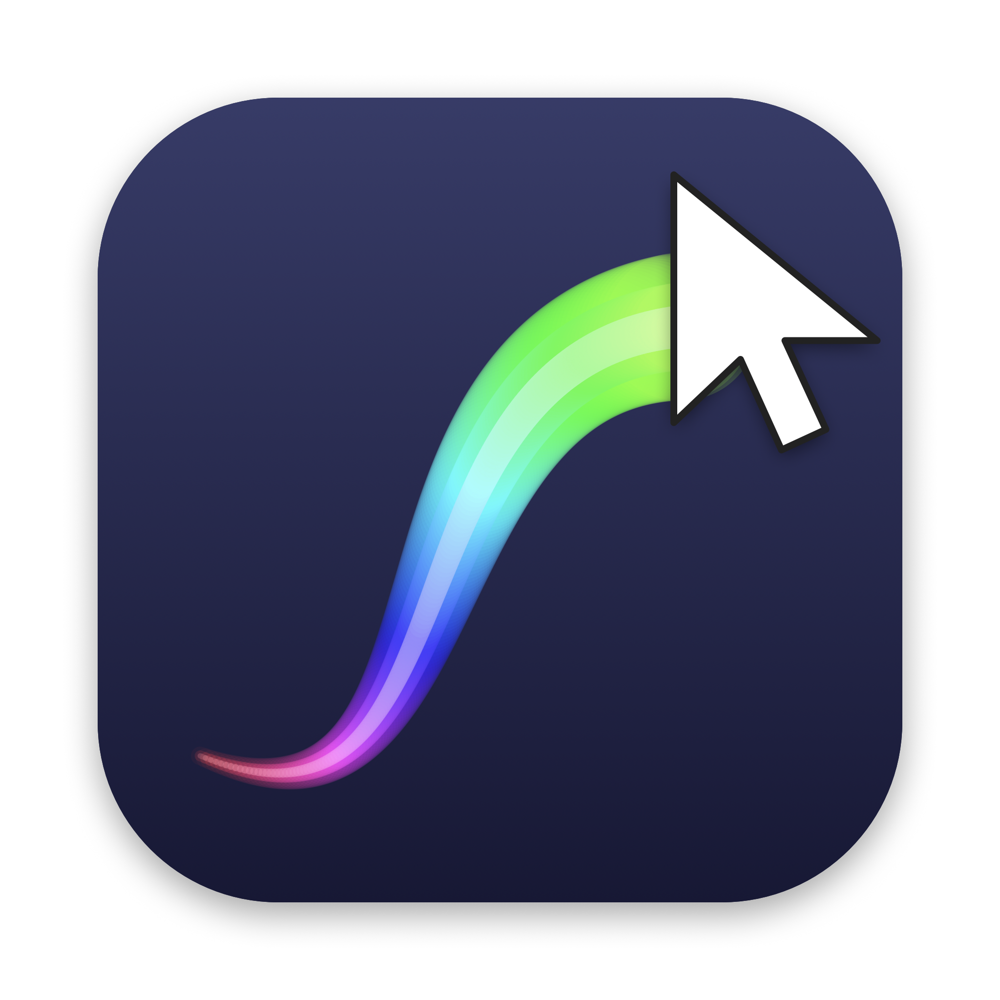

<p align="center">
  
</p>

<h1 align="center">Mouse Trail</h1>

<p align="center">
  A tiny macOS menu bar app that draws a colorful trail behind your mouse cursor.<br>
  Free, open source, no ads, no data collection.<br>
  <em>On Windows? Get the <a href="https://github.com/changymon/MouseTrail-Windows">Windows version</a>.</em>
</p>

---

## Why I made this

This app exists because of a World of Warcraft addon. I used a cursor
trail addon from CurseForge for years, and eventually realized the thing
I missed most outside the game wasn't anything in the game — it was
being able to *find my mouse*.

Like a lot of neurodivergent people, I constantly lose track of my
cursor. It's a small thing, but it happens dozens of times a day: eyes
scanning the screen, wiggling the mouse, hunting for a tiny arrow across
two displays. macOS has a shake-to-enlarge feature, but that only helps
after you've already lost it.

A trail fixes the problem at the source — your cursor becomes something
your eyes track effortlessly, all the time, because it moves with color
and motion instead of being a small static arrow. Everything else
followed from that: it had to be free, because an accessibility aid
shouldn't cost money; it had to stay out of the way, because it needs to
run all day; and it had to look good, because if something's going to be
on your screen every waking hour, it may as well have style.

If it helps you the way it helps me, that's the whole point. 🌈

## Features

- **Three styles** — clean **Line**, glowing **Comet**, or twinkling **Sparkles**
- **Any color** — rainbow mode, nine presets, or a custom color picker
- Adjustable **thickness** and **trail length**
- Works across **multiple displays** and full-screen apps, never blocks a click
- Lives in the **menu bar** (no Dock icon), remembers your settings
- Optional **launch at login**
- Lightweight: a single ~50 KB binary, no frameworks, no network access

## Install

1. Download **MouseTrail.zip** from the [latest release](../../releases/latest)
   and unzip it.
2. Drag **MouseTrail.app** into your **Applications** folder.
3. Open it. macOS will say it *"could not verify this app is free of malware"* —
   that's because this app isn't notarized by Apple (that requires a paid
   developer account; this is a free hobby project). To open it anyway:
   - Click **Done** on the warning, then go to
     **System Settings → Privacy & Security**, scroll down, and click
     **Open Anyway** next to MouseTrail. Confirm with **Open**.
   - *Or*, in Terminal:
     `xattr -d com.apple.quarantine /Applications/MouseTrail.app`

   You only need to do this once.
4. Look for the cursor icon in your menu bar and move your mouse!

If you'd rather not trust a downloaded binary, you can audit the code
(it's one Swift file, [main.swift](main.swift)) and build it yourself — see below.

## Build from source

Requires the Xcode Command Line Tools (`xcode-select --install`). Then:

```sh
git clone https://github.com/changymon/MouseTrail.git
cd MouseTrail
./build.sh
open MouseTrail.app
```

## Privacy

Mouse Trail reads the cursor position only to draw the trail, has no network
access, and collects nothing. See [privacy-policy.md](privacy-policy.md).

## License

[MIT](LICENSE) — do whatever you like with it.
